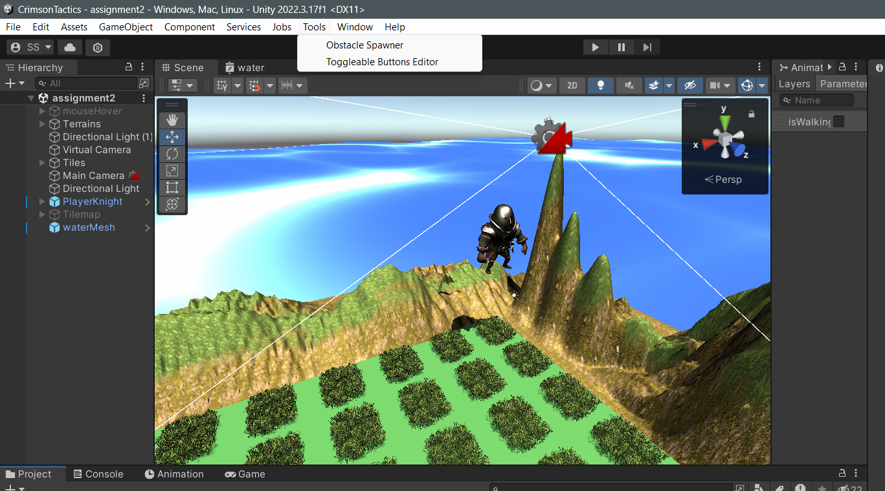
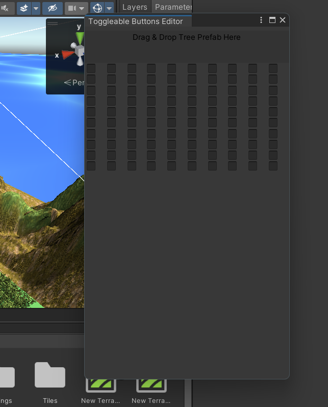
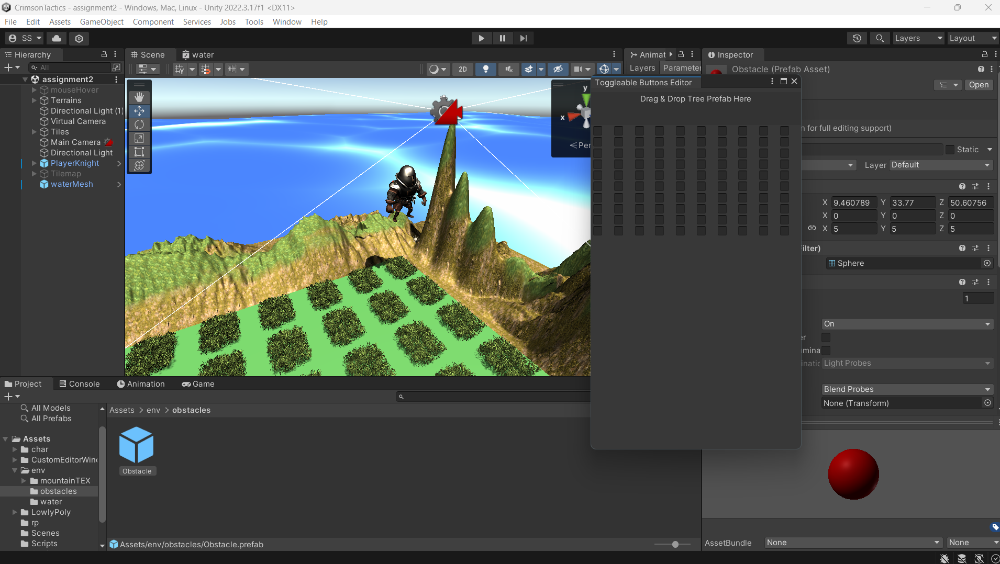
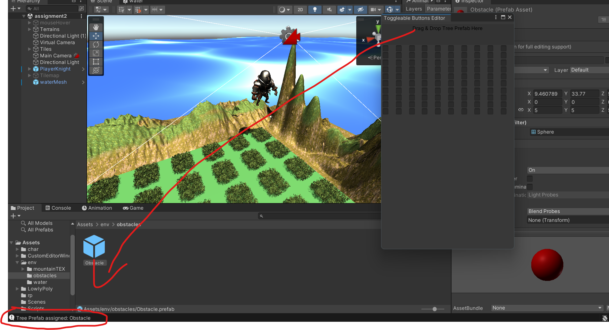
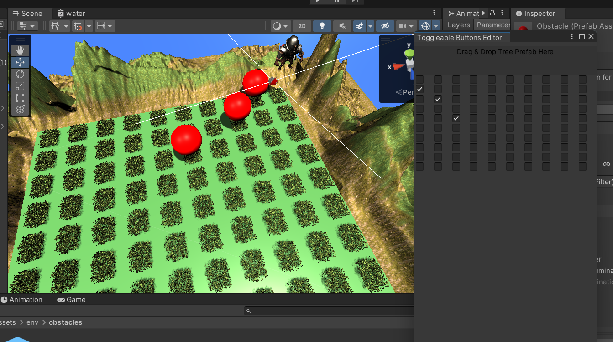

# CrimsonTactics1

Assignment 1 and 2 completed.
Working on Assignment 3 and 4 currently.
Will update it soon

How to access the toggelable buttons for obstacle spawning using unity toos

    1. 

        click on the toggelable button option

    2.  

        This is how the tool looks like

    3. 

        Drag the obstacle prefab to the slot

    4. 

        This confirmatory message will appear in the console when the prefab is succesfully assigned.

    5. 

        This is how the tool works
